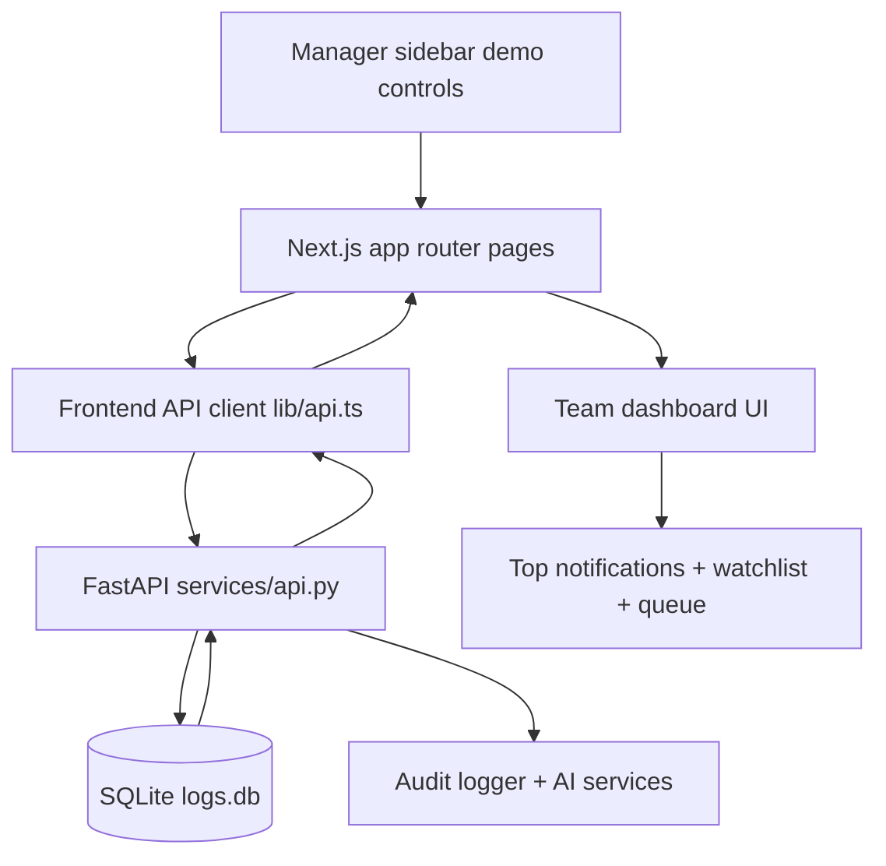

# AI-Assisted Log Analyzer

Version 2.0 introduces a role-aware web experience as the primary dashboard surface.

## Recruiter Snapshot

- Built an operations-focused incident triage tool with role-based workflows for ops engineers, support managers, and IT admins.
- Demonstrates MTTD-driven escalation logic with visible +5, +10, +15 minute notification behavior and acknowledgment-based suppression.
- Includes assignment/status controls, anomaly flagging, manager watchlist, and audit-aware AI summaries.
- Designed for repeatable demos with one-click demo log creation and cleanup.

## Overview

| | |
|---|---|
| **Friction** | Ops engineers spend 6–8 hours/week scanning logs. Mean time to detect anomalies is 47 minutes. |
| **Root Cause** | Logs are reviewed manually in CLI tools with no anomaly scoring or redaction layer. |
| **Solution** | Log viewer with anomaly scoring, safe AI summaries, and redaction before AI calls. |
| **Impact** | MTTD target under 10 minutes and less on-call time spent on manual scanning. |

## What Is New In 2.0

- Persona-based demo login for Alice, Bob, Carol, Dana, and Evan
- Role-aware views for ops engineers, support managers, and IT admins
- Manager-only assignment controls, workload sidebar, and AI ops brief
- Ops-focused personal stat cards while preserving visibility into the shared team queue
- Top-of-page timeline analytics for managers with stacked volume and level trend views
- Safe AI explanation flows backed by redaction and audit logging

## Why This Matters

- Reduces detection delay by turning anomaly scores into action-oriented triage and escalation.
- Reduces alert fatigue by suppressing escalation once a log is acknowledged (`in_review` or `resolved`).
- Improves accountability by tracking ownership, status transitions, and flagged-risk visibility.
- Improves manager awareness with a compact watchlist and AI-generated operations brief.

## Demo Paths

### Path A — MTTD Notification Demo (~90 seconds, primary)

Shows escalation logic, audible alerts, and acknowledgment-based suppression.

1. Sign in as **Dana** (support manager).
2. In the left sidebar, find **MTTD Notification Demo** and click **Show** if the panel is collapsed.
3. Click **Start Demo** to insert the demo anomaly log.
4. Click **+5m** → warning toast appears at the top of the page.
5. Click **+10m** → critical toast + 3-beep alert fires.
6. Click **+15m** → escalation banner (red, viewport-pinned) + 3-beep sequence fires.
7. Open the demo log, set status to **In Review**, and click **Save Assignment** — observe that the banner and toasts clear automatically.
8. Set status back to **New** to show notifications resume.
9. Click **Cleanup** to remove demo logs and reset state.

---

### Path B — Role Contrast (~30 seconds)

Shows RBAC in action: what an ops engineer sees versus what a manager sees.

1. Sign in as **Alice** (ops engineer).
   - Note: no sidebar workload panel, no team assignment controls, no Flagged Watchlist.
   - My Logs shows only her own assigned queue.
2. Sign out and sign in as **Dana** (support manager).
   - Note: sidebar shows team workload breakdown, MTTD demo controls, and AI Ops Brief.
   - Team dashboard shows all 6 stat cards including **Flagged** and **Avg Anomaly Score**.
   - Team queue allows reassignment to any engineer.

---

### Path C — Flagging Workflow (~45 seconds)

Shows risk flagging, RBAC enforcement, and manager watchlist.

1. Sign in as **Alice** (ops engineer).
2. Open any high-anomaly log from the team queue.
3. In the log detail modal, click **Flag as Risk**, enter a reason in the text area, and click **Save Flag**.
4. Sign out and sign in as **Dana** (support manager).
5. On the team dashboard, click the **Flagged** stat card — the queue filters to flagged logs only.
6. Scroll to the **Flagged Watchlist** section — the flagged log appears with an aging badge.
7. Open the log and click **Remove Flag** to clear it.

> Note: ops engineers can only flag logs assigned to them. Attempting to flag another engineer's log is blocked at both the API and UI level.

---

### Path D — AI Explanation (~20 seconds)

Shows the safe AI summary flow with redaction and audit logging.

1. Sign in as **Dana** or **Alice**.
2. Open any log with an anomaly score above 70.
3. In the log detail modal, click **Get AI Explanation**.
4. Observe the structured output: anomaly reasoning, recommended action, and redacted field indicators.
5. Close the modal — the explanation request is recorded in the audit trail.

## Architecture Flow



## Interfaces

### Web UI

```bash
cd web
npm install
npm run dev
```

Open http://localhost:3000/log-analyzer/team after starting the API.

The web UI is the current v2.0 demo surface. It includes:

- Persona-based login with role expectations on the sign-in screen
- Shared team queue with filters, stats, detail modal, and AI explanations
- Role-based workflow controls so only managers and admins can assign or reassign logs
- Personal queue behavior for ops engineers on `/log-analyzer/my-logs`
- Manager analytics and AI ops brief for support managers and IT admins

## Running (v2.0)

### API + Web Dashboard

```bash
# Terminal 1
py -m uvicorn services.api:app --reload --port 8000

# Terminal 2
cd web
npm run dev
```

Then open http://localhost:3000/log-analyzer/team.

The primary v2.0 dashboard flow is web-based:

- Team Dashboard: `/log-analyzer/team`
- Individual Dashboard: `/log-analyzer/my-logs`

### Legacy Streamlit Prototypes (optional)

The original Streamlit screens are still available for reference in `app/log_analyzer/app.py` and `app/log_analyzer/individual.py`, but they are no longer the primary v2.0 dashboard run path.

## Demo Personas

- Alice, Bob, Carol: ops engineers with personal queue views and status updates
- Dana: support manager with workload controls, team analytics, and ops brief access
- Evan: IT admin with the same elevated workflow visibility as the manager role

Both require `db/logs.db` — run `py scripts/bootstrap.py` first.
