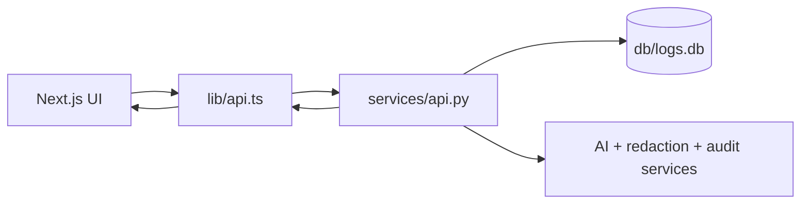

# Log Analyzer Web UI

Version 2.0 of the Log Analyzer web app adds persona-based authentication, role-aware dashboards, manager analytics, and tighter workflow controls on top of the original queue and AI explanation flows.

Next.js + React frontend for the log analyzer tool, calling FastAPI backend at `localhost:8000`.

## Quick Evaluator Notes

- This repo demonstrates role-aware incident triage UX, not just static dashboard visuals.
- Best demo login for full workflow: Dana (support manager).
- Key behavior to verify: escalation at +5/+10/+15, then automatic suppression when status moves from `unreviewed` to `in_review`.

## Setup

```bash
cd web
npm install
npm run dev
```

Open http://localhost:3000

## Version 2.0 Highlights

- Persona-based demo login for Alice, Bob, Carol, Dana, and Evan
- Distinct ops engineer, support manager, and IT admin experiences
- Team queue remains visible to ops users, while assignment controls stay manager-only
- Personal stats for ops users and timeline analytics for manager-level users
- Manager Ops Brief with safe AI summarization and audit-backed invocation
- My Logs automatically follows the signed-in persona instead of a manual engineer picker

## Demo Script (60-90 Seconds)

1. Open `/log-analyzer/team` as Dana.
2. In the sidebar, open MTTD Notification Demo and click Show if needed.
3. Click Start Demo.
4. Trigger +5m, +10m, +15m and observe warning -> critical -> escalation progression.
5. Open the demo log and move it to `in_review` to show suppression behavior.
6. Set it back to `unreviewed` to show notification resume behavior.
7. Click Cleanup to reset state.

## Architecture

- **Backend API**: `services/api.py` (FastAPI, runs on :8000)
- **Frontend**: Next.js (React + TypeScript, runs on :3000)
- **Proxy**: `next.config.ts` rewrites `/api/*` → `http://localhost:8000/api/*`

### Architecture Flow (Mermaid)



## Tech Stack

- Next.js 16, React 18, TypeScript 5.3
- Custom CSS with CSS variables (no Tailwind)
- Persona auth in local storage with bearer tokens for API requests

## Components

- **`components/LogTable.tsx`** — Filterable table of logs with level/status badges
- **`components/Filters.tsx`** — Level, service, status, sort, anomaly-only filters
- **`components/LogDetail.tsx`** — Modal showing full log detail, assignment details, and AI explanation
- **`components/AssignmentPanel.tsx`** — Quick assign panel for manager-level users
- **`components/AuthWrapper.tsx`** — Persona login shell and role-aware app chrome
- **`components/ManagerTimelineChart.tsx`** — Manager-only timeline analytics card

## Pages

### `/log-analyzer/team`

Team-wide dashboard with:
- Role-aware stats cards
- Filters + sorting
- Shared team log table for all authenticated roles
- Quick assign panel for support managers and IT admins
- Top-of-page timeline analytics for support managers and IT admins
- Manager Ops Brief for support managers and IT admins
- Log table with click-to-detail

### `/log-analyzer/my-logs`

Individual dashboard with:
- Signed-in persona context instead of an engineer selector
- Stats for the current user's assigned logs
- Log table for the current user's queue
- Status workflow (unreviewed → in_review → resolved)

## API Integration

See `lib/api.ts` for all fetch wrappers.

Available demo personas:

```typescript
alice -> Bearer token-alice
bob   -> Bearer token-bob
carol -> Bearer token-carol
dana  -> Bearer token-manager
evan  -> Bearer token-it
```

Manager-only workflow endpoints enforce assignment permissions on the backend. Ops users can still update log status through the status endpoint.

## Running Both Services

```bash
# Terminal 1: FastAPI backend
cd sandbox
py -m uvicorn services.api:app --reload --port 8000

# Terminal 2: Next.js frontend
cd sandbox/web
npm run dev
```

Then visit http://localhost:3000/log-analyzer/team
