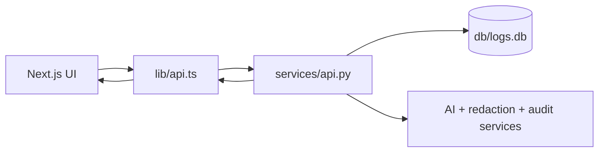

# Internal Tools Web Platform

Current release provides a shared Next.js + React frontend for Tool 1 (Support Ticket Triage), Tool 4 (Log Analyzer), and Tool 2 (QA Defect Pattern Analyzer), backed by FastAPI on `localhost:8000`.

## Scope Clarification

- This `web/` app is the active release surface for Tool 1, Tool 2, and Tool 4.
- Streamlit-based UIs in `app/` are legacy/prototype modules and are not required for this web workflow.
- Running this frontend only requires FastAPI + Next.js as shown below.

## Quick Evaluator Notes

- This repo demonstrates role-aware incident triage UX, not just static dashboard visuals.
- Best demo login for full workflow: Dana (support manager).
- Key behavior to verify: escalation at +5/+10/+15, then automatic suppression when status moves from `unreviewed` to `in_review`.

## Setup

```bash
# Terminal 1 (from repo root)
py -m uvicorn services.api:app --reload --port 8000

# Terminal 2
cd web
npm install
npm run dev -- --webpack
```

Open one of these routes:

- http://localhost:3000/support-triage/tickets
- http://localhost:3000/log-analyzer/team
- http://localhost:3000/qa-analyzer/sprint

## Current Highlights

- Persona-based demo login for Alice, Bob, Carol, Dana, Evan, Quinn, Riley, Taylor, and Morgan
- Distinct ops/support and QA role experiences with RBAC-enforced endpoints
- Support triage dashboard with risk-aware queueing and safe AI ticket summaries
- Log Analyzer and QA Analyzer share one authentication shell with role-based tool visibility
- Support Triage, Log Analyzer, and QA Analyzer share one authentication shell with role-based tool visibility
- Personal stats for ops users, timeline analytics for manager-level users, and QA sprint triage modal workflow
- Manager Ops Brief with safe AI summarization and audit-backed invocation
- My Logs automatically follows the signed-in persona instead of a manual engineer picker

## Demo Script (60-90 Seconds)

1. Open `/log-analyzer/team` as Dana.
2. In the sidebar, open MTTD Notification Demo and click Show if needed.
3. Click Start Demo.
4. Trigger +5m, +10m, +15m and observe warning -> critical -> escalation progression.
5. Open the demo log and move it to `in_review` to show suppression behavior.
6. Set it back to `unreviewed` to show notification resume behavior.
7. Click Cleanup to reset state.

Optional QA pass:

1. Sign in as Morgan and open `/qa-analyzer/sprint`.
2. Run clustering and duplicate detection for one sprint.
3. Open a defect, add a triage note, and confirm it appears in note history.

## Architecture

- **Backend API**: `services/api.py` (FastAPI, runs on :8000)
- **Frontend**: Next.js (React + TypeScript, runs on :3000)
- **Proxy**: `next.config.ts` rewrites `/api/*` → `http://localhost:8000/api/*`

### Architecture Flow (Mermaid)



## Tech Stack

- Next.js 16, React 18, TypeScript 5.3
- Custom CSS with CSS variables (no Tailwind)
- Persona auth in local storage with bearer tokens for API requests

## Components

- **`components/LogTable.tsx`** — Filterable table of logs with level/status badges
- **`components/Filters.tsx`** — Level, service, status, sort, anomaly-only filters
- **`components/LogDetail.tsx`** — Modal showing full log detail, assignment details, and AI explanation
- **`components/AssignmentPanel.tsx`** — Quick assign panel for manager-level users
- **`components/AuthWrapper.tsx`** — Persona login shell and role-aware app chrome
- **`components/ManagerTimelineChart.tsx`** — Manager-only timeline analytics card

## Pages

### `/support-triage/tickets`

Support dashboard with:
- Ticket queue table and drill-in detail panel
- SLA/risk/search filters and risk-band KPI cards
- Sidebar queue age trackers: oldest age, average queue age, and age by SLA tier
- Escalation controls (request + manager approve/reject/clear) with status visibility
- Safe-mode AI summary generation for ticket descriptions
- Role-aware data masking for support agents

### `/log-analyzer/team`

Team-wide dashboard with:
- Role-aware stats cards
- Filters + sorting
- Shared team log table for all authenticated roles
- Quick assign panel for support managers and IT admins
- Top-of-page timeline analytics for support managers and IT admins
- Manager Ops Brief for support managers and IT admins
- Log table with click-to-detail

### `/log-analyzer/my-logs`

Individual dashboard with:
- Signed-in persona context instead of an engineer selector
- Stats for the current user's assigned logs
- Log table for the current user's queue
- Status workflow (unreviewed → in_review → resolved)

### `/qa-analyzer/sprint`

QA dashboard with:
- Sprint-centered defect queue and filter controls
- AI clustering and duplicate detection previews
- Duplicate summary/detail split layout with confidence and rationale
- Defect triage modal with keyboard navigation, assignment, status actions, and note history
- CSV export and role-enforced action permissions

## API Integration

See `lib/api.ts` for all fetch wrappers.

Available demo personas:

```typescript
sage   -> Bearer token-agent
alice  -> Bearer token-alice
bob    -> Bearer token-bob
carol  -> Bearer token-carol
dana   -> Bearer token-manager
evan   -> Bearer token-it
quinn  -> Bearer token-qa
riley  -> Bearer token-qa-lead
taylor -> Bearer token-qa-taylor
morgan -> Bearer token-qa-manager
```

RBAC is enforced on backend endpoints. Examples:
- Ops users cannot perform manager-only log assignment actions.
- QA engineers cannot mark `duplicate_merged`.
- QA engineers cannot update defects assigned to another engineer.

## Running Both Services

```bash
# Terminal 1: FastAPI backend
cd sandbox
py -m uvicorn services.api:app --reload --port 8000

# Terminal 2: Next.js frontend
cd sandbox/web
npm run dev -- --webpack
```

Then visit:

- http://localhost:3000/support-triage/tickets
- http://localhost:3000/log-analyzer/team
- http://localhost:3000/qa-analyzer/sprint
